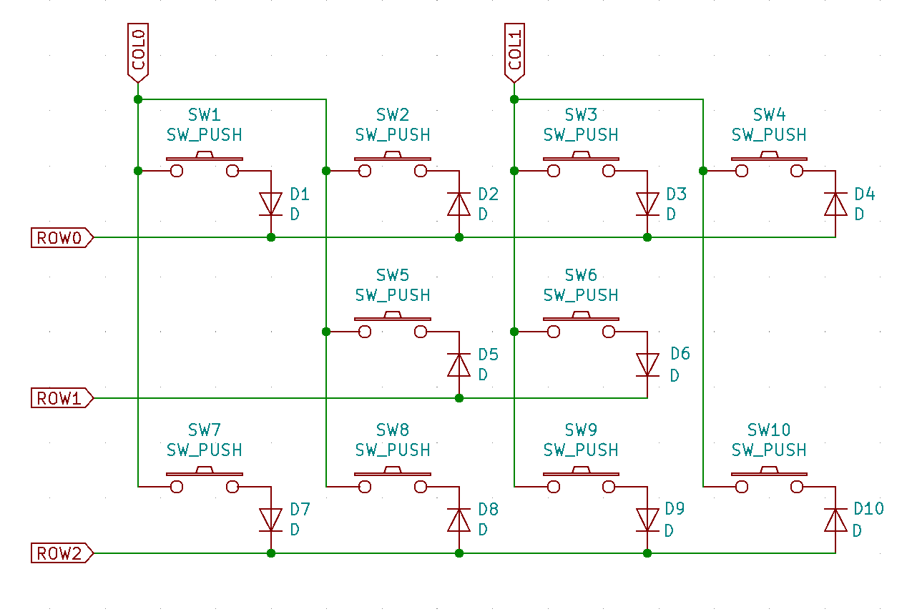

## Valid version

|Feature|Version|
|----|----|
|Normal matrix|0.9.0+|
|Direct-scan|0.9.9+|
|Duplex and Round-robin matrix|0.9.11+|

## Normal matrix

```ruby
kbd = Keyboard.new
kbd.init_pins(
  [ 12, 11, 10, 9, 8 ], # row0, row1,... respectively
  [ 7, 6, 5, 4, 3, 2 ]  # col0, col1,... respectively
)
```

## Direct-scan

Direct-scan circuit has no diode and one-to-one correspondence between pins and switches.

```ruby
kbd.init_direct_pins(
  [ 8, 27, 28, 29, 9, 26 ]
)
```

Above code is equivalent to:

```ruby
kbd.set_scan_mode = :direct
kbd.init_pins(
  [],
  [ 8, 27, 28, 29, 9, 26 ]
)
```

## Duplex and Round-robin matrix

Let's say there is a duplex matrix circuit like this:



You can configure the pins and layers as follows:

```ruby
# The actual pin numbers depend on your circuit
row0 = 1
row1 = 2
row2 = 3
col0 = 4
col1 = 5
# Init duplex matrix
kbd.init_matrix_pins(
  [
    [ [row0, col0], [col0, row0], [row0, col1], [col1, row0] ],
    [          nil, [col0, row1], [row1, col1],          nil ],
    [ [row2, col0], [col0, row2], [row2, col1], [col1, row2] ]
  ]
)
kbd.add_layer :default, %i(
      KC_1          KC_2          KC_3          KC_4
                    KC_A          KC_B
      KC_LCTL       KC_SPACE      KC_ENTER      KC_RSFT
)
```

- In `Keyboard#init_matrix_pins`, put `nil` where an actual switch doesn't exist
- You have to leave blanks in `Keyboard#add_layer` at the positions that correspond to `nil` as the above code shows

### Split-type keyboard

```ruby
kbd.split = true
kbd.init_matrix_pins(
  [
    [ [row0, col0], [col0, row0], [row0, col1], [col1, row0] ],
    [          nil, [col0, row1], [row1, col1],          nil ],
    [ [row2, col0], [col0, row2], [row2, col1], [col1, row2] ]
  ]
)
kbd.add_layer :default, %i(
      KC_1          KC_2          KC_3          KC_4         KC_5          KC_6          KC_7          KC_8
                    KC_A          KC_B                                     KC_C          KC_D
      KC_LSFT       KC_LALT       KC_LCTL       KC_SPACE     KC_ENTER      KC_BSPACE     KC_RGUI       KC_RSFT
)
```

Also, `kbd.split_style = :right_side_flipped_split` should work. See [[Right-side-flipped split]]

### Relation between `init_pins` and `init_matrix_pins`

Following two codes are internally equivalent:

```ruby
kbd.init_pins(
  [ 1, 2 ],
  [ 3, 4 ]
)
```

```ruby
kbd.init_matrix_pins(
  [
    [ [1 ,3], [1 ,4] ],
    [ [2 ,3], [2, 4] ],
  ]
)
```

Namely, `Keyboard#init_pins` is a wrapper method of `Keyboard#init_matrix_pins` for "normal matrix".

### Tell us if you have a Round-robin matrix

`Keyboard#init_matrix_pins` should cover also "Round-robin matrix" though, the dev team hasn't tested on an actual keyboard yet.
Any feedback even it's working is welcome!
