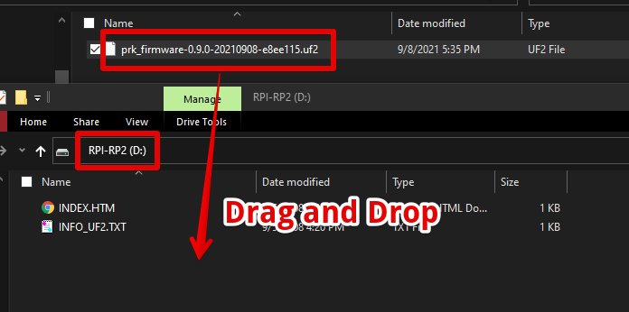

First of all, you should:

- Be knowledgeable how to install a UF2 file into Raspi Pico on [https://www.raspberrypi.org/documentation/rp2040/getting-started/#getting-started-with-c](https://www.raspberrypi.org/documentation/rp2040/getting-started/#getting-started-with-c)
  - [https://learn.sparkfun.com/tutorials/pro-micro-rp2040-hookup-guide](https://learn.sparkfun.com/tutorials/pro-micro-rp2040-hookup-guide) will also be helpful if you use Sparkfun Pro Micro RP2040

## Use a release binary

- Download the newest release binary from [Releases](https://github.com/picoruby/prk_firmware/releases)

- Unzip it. You should get a file that looks like `prk_firmware-0.9.0-20210910-xxxxxxxx.uf2`

- Flash the uf2 into RP2040

  

- `PRKFirmware` mass storage drive should be mounted, then drag and drop your `keymap.rb`

  

Your keyboard will automatically reboot. Enjoy!
