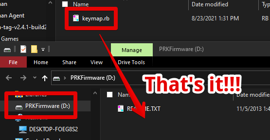

First of all, you should learn how to install a UF2 file into Raspberry Pi Pico by reading a section "3.2.1. From the desktop" (page 10) of this document:

[https://datasheets.raspberrypi.com/pico/getting-started-with-pico.pdf](https://datasheets.raspberrypi.com/pico/getting-started-with-pico.pdf)

The following page is also helpful if you use Sparkfun Pro Micro RP2040:

[https://learn.sparkfun.com/tutorials/pro-micro-rp2040-hookup-guide](https://learn.sparkfun.com/tutorials/pro-micro-rp2040-hookup-guide)

## Let's try it!

- Download the newest release binary from [Releases](https://github.com/picoruby/prk_firmware/releases)

- Unzip it. You should get a file that looks like `prk_firmware-0.9.0-20210910-xxxxxxxx.uf2`

- Drag and drop the uf2 file into the `RPI-RP2` drive which BOOTSEL-mode RP2040 mounts

  

- `RPI-RP2` drive will disappear, after a few seconds, `PRKFirmware` mass storage drive will automatically mount instead

- Drag and drop your `keymap.rb` into the `PRKFirmware` drive

  

PRK Firmware will automatically reload the `keymap.rb`. Enjoy!

### Points you should know

- Dragging and dropping `keymap.rb` does not unmount the `PRKFirmware` drive
- Reloading `keymap.rb` takes five to seven seconds depending on the `keymap.rb` and the circuit
- It looks nothing happened even if a new `keymap.rb` was successfully reloaded especially in case your keyboard doesn't have RGBLED on it. But the new configuration should have been applied if there is no trouble with the `keymap.rb`
- If your `keymap.rb` doesn't work, [[Debug print]] page may help you

### Editing the `keymap.rb`

- From the second time, you can overwrite the existing `keymap.rb` in the `PRKFirmware` drive
- You might be able to directly edit the `keymap.rb` in the `PRKFirmware` drive though, to avoid unexpected trouble, we'd recommend you to edit the `keymap.rb` in your disk of the host computer then drag and drop it again into the `PRKFirmware` drive

### Upgrading PRK Firmware

- When you want to install a new uf2 file of PRK Firmware, make sure the mass storage drive is `RPI-RP2`, not `PRKFirmware`
- RP2040 in which PRK Firmware is already installed can reboot to BOOTSEL mode and mount `RPI-RP2` drive by double-pressing the RESET button without detaching the USB cable
